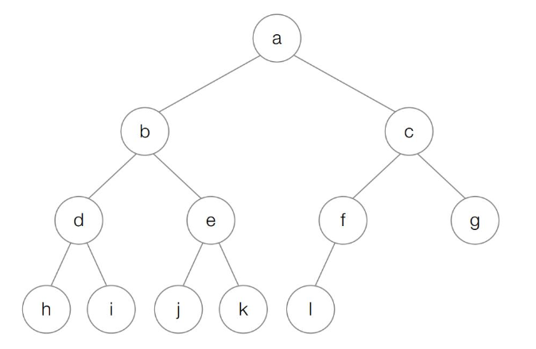
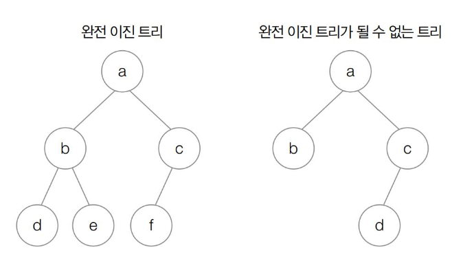
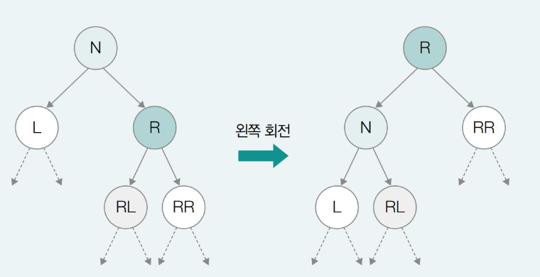
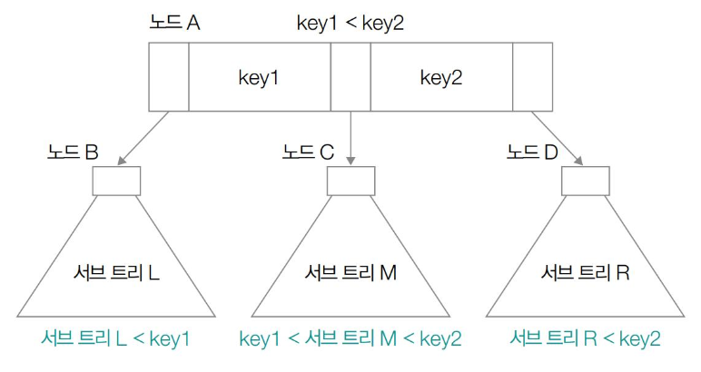

# 4.5 트리

## 트리 관련 주요 용어

| 용어        | 정의 및 특징                                                    |
|:----------|:-----------------------------------------------------------|
| **트리**    | 계층적인 구조를 표현하기 위한 자료구조로, 데이터가 저장된 `노드`와 이를 연결하는 `간선`으로 구성됨. |
| **노드**    | 트리를 구성하는 기본 단위로, 실제 **데이터**가 저장되어 있는 공간임.                  |
| **간선**    | 노드와 노드를 연결하는 선으로, 데이터 간의 **상하 관계 및 연결 상태**를 나타냄.           |
| **부모 노드** | 노드 간의 상하 관계에서 상위에 위치한 노드임. (하나의 노드는 하나의 부모 노드만 가질 수 있음.)        |
| **자식 노드** | 노드 간의 상하 관계에서 하위에 위치한 노드임. (하나의 노드가 여러 자식 노드를 가질 수 있음.)    |
| **형제 노드** | 동일한 부모 노드를 공유하는 노드들을 의미함.                                  |
| **조상 노드** | 특정 노드의 부모 노드를 포함하여 그 상위에 연결된 모든 부모 노드들을 뜻함.                |
| **자손 노드** | 특정 노드의 자식 노드를 포함하여 그 하위에 연결된 모든 자식 노드들을 뜻함.                |
| **루트 노드** | 부모 노드가 없는 **트리의 최상단 노드**로, 트리의 시작점이 됨.                     |
| **리프 노드** | 트리의 최하단 끝에 위치한 노드로, **더 이상의 자식 노드가 없는 노드**임.               |
| **서브 트리** | 전체 트리 구조 내에 포함되어 있는 부분적인 트리로, 그 자체로도 루트 노드를 가짐.            |
| **차수**    | 각 노드가 가지고 있는 **자식 노드의 수**임. (자식이 없는 리프 노드의 차수는 `0`임.)      |
| **레벨**    | 루트 노드에서 시작해 특정 노드에 이르기까지 거치는 간선의 수로, **트리의 깊이**와 같은 개념임.   |
| **높이**    | 트리 내에서 **가장 높은 레벨**을 의미함.                                  |

## 트리의 순회
- **트리의 순회**: 트리의 모든 노드를 한 번씩 방문하는 것을 말함.
- 대표적으로 전위 순회, 중위 순회, 후위 순회가 있음.
- 
  - 전위 순회 순서: a -> b -> d -> h -> i -> e -> j -> k -> c -> f -> l -> g
  - 중위 순회 순서: h -> d -> i -> b -> j -> e -> k -> a -> l -> f -> c -> g
  - 후위 순회 순서: h -> i -> d -> j -> k -> e -> b -> l -> f -> g -> c -> a

### 전위 순회
- 루트 노드부터 시작해 왼쪽 서브트리를 전위 순회하고, 이후 오른쪽 서브트리를 전위 순회하는 방식임.
- 루트 노드 -> 왼쪽 서브트리 전위 순회 -> 오른쪽 서브트리 전위 순회
```text
전위 순회(노드):
    if 노드가 존재하지 않으면:
        return
    노드 값 출력
    전위 순회(노드의 왼쪽 자식)
    전위 순회(노드의 오른쪽 자식)
```

### 중위 순회
- 루트 노드 기준으로 왼쪽 서브트리를 중위 순회한 다음, 루트 노드를 방문하고, 오른쪽 서브트리를 중위 순회하는 방식임.
- 왼쪽 서브트리 중위 순회 -> 루트 노드 -> 오른쪽 서브트리 중위 순회
```text
중위 순회(노드):
    if 노드가 존재하지 않으면:
        return
    중위 순회(노드의 왼쪽 자식)
    노드 값 출력
    중위 순회(노드의 오른쪽 자식)
```

### 후위 순회
- 루트 노드 기준 왼쪽 서브트리를 후위 순회하고, 오른쪽 서브트리까지 후위 순회한 다음, 루트 노드를 방문하는 방식임.
- 왼쪽 서브트리 후위 순회 -> 오른쪽 서브트리 후위 순회 -> 루트 노드
```text
후위 순회(노드):
    if 노드가 존재하지 않으면:
        return
    후위 순회(노드의 왼쪽 자식)
    후위 순회(노드의 오른쪽 자식)
    노드 값 출력
```

## 트리의 종류

### 이진 트리

| 용어                                    | 정의 및 특징                                                                                  |
|:--------------------------------------|:-----------------------------------------------------------------------------------------|
| **이진 트리**                             | 모든 노드의 **자식 노드 개수가 2개 이하**인 트리임. 즉, 각 노드는 0개, 1개, 또는 2개의 자식만을 가질 수 있음.                   |
| **편향된 이진 트리**                         | 말 그대로 자식 노드가 **한쪽 방향으로만 치우쳐진** 이진 트리임. 왼쪽이나 오른쪽으로만 늘어선 형태라 배열이나 연결 리스트처럼 선형적인 구조를 띄게 됨.  |
| **정 이진 트리**                           | 자식 노드의 개수가 **0개 또는 2개**인 이진 트리임. 자식 노드를 1개만 가진 노드가 존재하지 않는다는 특징이 있음.                     |
| **포화 이진 트리**                          | 리프 노드를 제외한 **모든 노드가 자식을 2개씩** 가지고 있으며, **모든 리프 노드의 레벨이 동일**한 트리임. 완벽한 삼각형 모양을 이룸.        |
| **완전 이진 트리**                          | 마지막 레벨을 제외한 모든 레벨에서 노드가 가득 차 있고, **마지막 레벨의 노드들은 왼쪽부터 차례대로 채워진** 이진 트리임. 힙 등의 자료구조 기틀이 됨. |

- 
  - 오른쪽 트리는 마지막 레벨의 노드가 왼쪽부터 채워지지 않아서 완전 이진 트리가 아님.

### 탐색에 활용되는 트리: 이진 탐색 트리와 힙
#### 이진 탐색 트리
- 특정 노드의 왼쪽 서브트리에는 해당 노드보다 작은 값을 지닌 노드들이 있고, 오른쪽 서브트리에는 해당 노드보다 큰 값을 지닌 노드들이 있는 구조의 이진 트리임.
- 이진 탐색 트리를 사용하면 $O(\log n)$으로 원하는 값을 탐색할 수 있다는 장점이 있음.
- 단, 최악의 상황인 편향된 이진 트리의 경우 탐색 속도는 $O(n)$임.

#### 힙
- 최대값과 최솟값을 빠르게 찾기 위해 사용되고, **최대 힙**과 **최소 힙**이 있음.
- 최대 힙은 부모 노드가 자식 노드의 값보다 큰 값으로 이루어진 이진 트리이고, 최소 힙은 부모 노드가 자식 노드의 값보다 작은 값으로 이루어진 이진 트리임.
- 힙을 사용하면 탐색에 $O(\log n)$의 시간 복잡도가 소요됨.
- 우선순위 큐는 힙으로 구현할 수 있음.

### 균형을 맞추는 트리: RB 트리
- 이진 탐색 트리의 탐색 성능을 언제나 균일하게 유지하려면 루트 노드 기준 왼쪽 서브트리와 오른쪽 서브트리의 높이 차이가 최소화되어야 함.
- **자가 균형 이진 탐색 트리**: 왼쪽 서브트리와 오른쪽 서브트리 높이의 균형을 맞추는 이진 탐색 트리로, 대표적으로 `AVL 트리`와 `RB 트리`가 있음.
- 특히 RB 트리는 CFS 스케줄러와 프로그래밍 언어 내부 구현에도 사용됨.

#### RB 트리
- 모든 노드를 빨간색 혹은 검은색으로 칠한 트리임. 노드에 색을 칠하는 규칙과 노드에 칠해진 색을 기준으로 왼쪽 서브트리와 오른쪽 서브트리 높이의 균형을 맞춤.
```text
RB 트리가 유지되는 조건

1️⃣ 루트 노드는 블랙 노드이다.
2️⃣ 리프 노드는 블랙 노드이다.
3️⃣ 레드 노드의 자식의 노드는 블랙 노드이다.
4️⃣ 루트 노드에서 임의의 리프 노드에 이르는 경로의 블랙 노드 수는 같다.
```
- RB 트리의 리프 노드는 실질적인 데이터가 저장되어 있지 않는 노드라고 가정하고 `NIL(Null Leaf Node)`라고 함.
- RB 노드에 새 노드를 삽입할 때는 삽입할 노드를 레드로 간주하고, 이진 탐색 트리와 동일하게 삽입을 수행하고, RB 트리 조건에 부합하지 않는다면 부합할 때까지 트리를 회전하거나 색상을 재지정함.
  - 회전 예시
    

### 대용량 입출력을 위한 트리: B 트리
- B 트리 또한 균형을 유지하는 트리 중 하나이고, 다진 탐색 트리의 한 종류임.
- 한 노드가 가질 수 있는 최대 자식 노드의 개수가 M개인 B 트리는 M차 B트리라고 부름.
- M차 B트리가 가질 수 있는 최소 자식 노드의 개수는 $\lceil M/2 \rceil$개임.
- B 트리의 각 노드에는 하나 이상의 키 값이 존재하고 각 키들이 오름차순으로 저장되어 있음.
- B 트리는 각 키 사이에 자식 노드의 위치를 저장하고 있어서 키가 자식 노드가 가질 수 있는 값의 범위를 나타내는 역할을 함.
- 키가 N개인 노드가 가질 수 있는 자식 노드의 수는 (N+1)개가 됨.
- B 트리는 모든 리프 노드의 깊이가 같다는 특징도 있음.
- 오늘날에는 B+ 트리를 사용하는 경우가 많은데 B+ 트리에서는 실질적인 데이터가 모두 최하위 리프 노드에 위치하고, 실질적 데이터를 저장하는 최하위 리프 노드는 연결 리스트의 형태를 띠고 있어서 범위 연산에 용이함.


> 위의 트리 외에도 트라이, 세그먼트 트리, 펜윅 트리 등이 있음.
